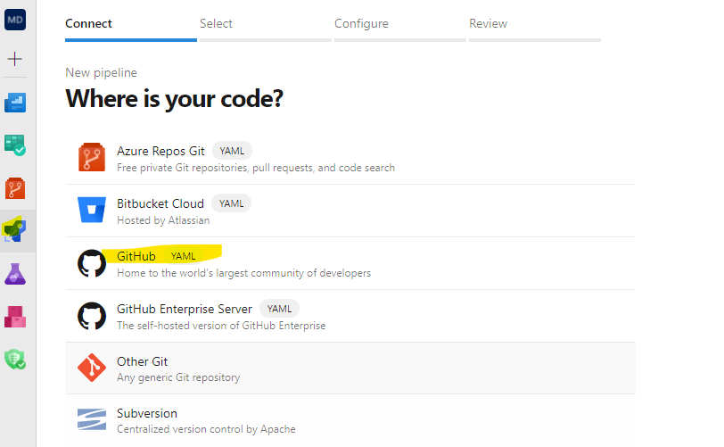
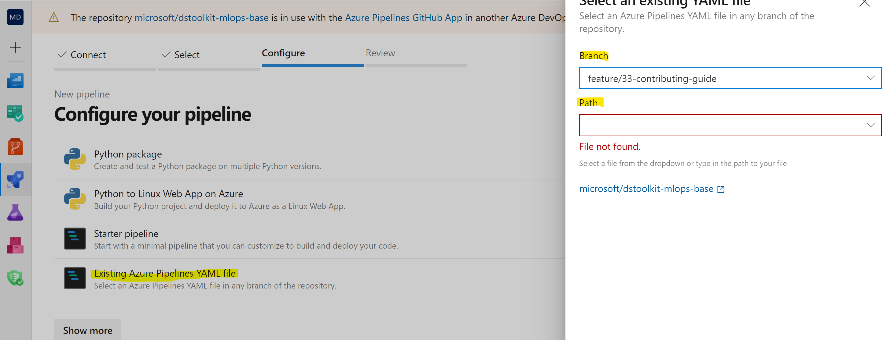

# Contributing

Welcome, and thank you for your interest in contributing. There are many ways to contribute:

- [Submit issues](https://github.com/microsoft/dstoolkit-mlops-base/issues) to report bugs and make suggestions. Please search the existing  issues before filing new issues to avoid duplicates. For new issues, file your bug or feature request as a new Issue and select the appropriate label from the available labels.

- Review the [source code changes](https://github.com/microsoft/solution-accelerator-many-models/pulls).
  
- Contribute features and fixes by forking the repository and creating a [pull request](https://github.com/microsoft/dstoolkit-mlops-base/compare).

- The naming convention for new features branches is _feature(fix)/issueNumber-description_. Example: _feature/13-doc-contribution_

## How to get started

To develop in your own environment, you will need an Azure Devops project.

1. Fork this repo to your own repository.

2. Define your variables and setup the infrastructure following this [guide](https://github.com/microsoft/dstoolkit-mlops-base/blob/main/docs/how-to/GettingStarted.md)

3. Create a new branch: feature/_your-custom-name_ (or fix instead of feature)

4. To run your ADO pipeline in your environment:
   - Go to your Azure Devops project, pipeline and click on new pipeline
   - Select "GitHub"\
    
   - Give Azure Devops access to your Github Account
   - Search for the _microsoft/dstoolkit-mlops-base_ in "all repositories" (it may take a while to ADO to find it if you have just set the connection)
   - Select _Existing Azure Pipelines YAML file_, select your branch and the pipeline you want to run 

You should now be able to run azure devops pipeline in your own subscription. Once your satisfied with your changes, you may create a [new pull request](https://github.com/microsoft/dstoolkit-mlops-base/pulls). In your comments, please add a reference to the related issue by simply typing "#" and then selecting the issue.

## Contributor License Agreement

This project welcomes contributions and suggestions.  Most contributions require you to agree to a
Contributor License Agreement (CLA) declaring that you have the right to, and actually do, grant us
the rights to use your contribution. For details, visit <https://cla.opensource.microsoft.com>.

When you submit a pull request, a CLA bot will automatically determine whether you need to provide
a CLA and decorate the PR appropriately (e.g., status check, comment). Simply follow the instructions
provided by the bot. You will only need to do this once across all repos using our CLA.

## Microsoft Open Source Code of Conduct

This project has adopted the [Microsoft Open Source Code of Conduct](https://opensource.microsoft.com/codeofconduct/). For more information see the [Code of Conduct FAQ](https://opensource.microsoft.com/codeofconduct/faq/) or contact [opencode@microsoft.com](mailto:opencode@microsoft.com) with any additional questions or comments.
