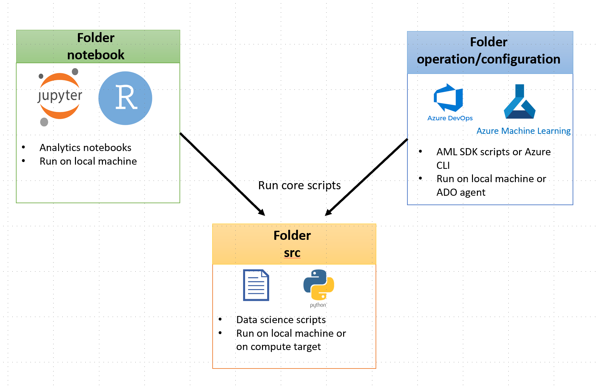

# MLOps Solution Accelerator

This repository contains the basic repository structure for machine learning projects based on Azure technologies (Azure Machine Learning and Azure DevOps).
The folder names and files are chosen based on personal experience. You can find the principles and ideas behind the structure, which we recommend to follow when customizing your own project and MLOps process. Also, we expect users to be familiar with Azure Machine Learning (AML) concepts and how to use the technology.

## Prerequisites

In order to successfully complete your solution, you will need to have access to and or provisioned the following:

- Access to an Azure subscription
- Access to an Azure Devops subscription
- Service Principal

## Getting Started

Follow the step below to setup the project in your subscription.

1. **Setting up the Azure infrastructure:**

   - For general best-practices, we invite you to visit the official [Cloud Adoption Framework](https://docs.microsoft.com/en-us/azure/cloud-adoption-framework/ready/azure-best-practices/ai-machine-learning-resource-organization?branch=pr-en-us-1541)

   - if you are starting with MLOps, you will find the necessary Azure Devops pipelines and ARM templates in the folder _infra_ to setup the recommended infrastructure. To deploy the infrastructure have a look at [Infrastructure Setup](./docs/how-to/InfrastructureDesign.md).

   - if you already have a preferred architecture and Azure resources, you can delete the infrastructure folder. Nevertheless, we invite you to have a look the recommended infrastructure ['AzureDevops'](./docs/how-to/GettingStarted.md#run-the-pipeline). To use this template, you need to create a service principal to [manage identities in ADO](https://docs.microsoft.com/en-us/azure/devops/pipelines/library/connect-to-azure?view=azure-devops), (if needed) [connect Azure KeyVault to ADO](https://docs.microsoft.com/en-us/azure/devops/pipelines/release/azure-key-vault?view=azure-devops), and [add environmental variables to in ADO](https://docs.microsoft.com/en-us/azure/devops/pipelines/library/variable-groups?view=azure-devops&tabs=classic).

2. **Creating your CI/CD Pipeline to Azure Devops.** In the folder **./azure-pipelines** you will find the yaml files to setup your CI/CD pipeline in Azure Devops (ADO). To do so, have a look at ['Azure Devops Setup'](./docs/how-to/GettingStarted.md#run-the-pipeline).

If you have managed to run the entire example, well done! You can now adapt the same code to your own use case with the exact same infrastructure and CI/CD pipeline. To do so, follow these steps:

1. Add your AML-related variables (model, dataset name, experiment name, pipeline name ...) in the configuration file [configuration-aml.variables.yml](./configuration/configuration-aml.variables.yml).

2. Add your infra-related environment variables (azure environment, ...) in [configuration-infra-*.variables.yml](./configuration/configuration-infra-DEV.variables.yml) in the [**./configuration**](./configuration/) folder. By default, the template provides two yaml files for DEV and PROD environment.

3. Add your core machine learning code (feature engineering, training, scoring, etc) in [**./src**](./src/). We provide the structure of the core scripts. You can fill the core scripts with your own functionality.

4. If needed, adapt the ML operation scripts that handle the core scripts (e.g sending the training script to a compute target, registering a model, creating an azure ml pipeline,etc) in [**./mlops**](./mlops/). We provide some examples to easily setup your experiments and Azure Machine Learning pipelines.

The project folders are structured in a way to rapidly move from a notebook experimentation to refactored code ready for deployment as following: 

## Core MLOps Principles

1. **Continuous Integration**: testing ML systems comes down to testing feature engineering scripts, validating data schema, testing the model and validating the ML infrastructure (access permission, model registries, inference service,...).

2. **Continuous Delivery**: CD in the context of ML is the capacity to automatically deliver artefacts to different environment (i.e DEV/STAGE/PROD). ML artefacts consist of a feature engineering pipeline, a model, and an automated retraining pipeline depending on the use-case.

3. **Continuous Monitoring**: it is mandatory to provide a consistent feedback loop from model prediction results in production. The only real model test is in production where the model is fed live data. Hence, not having a monitoring system in place to enable ML practitioners to review model predictions may have catastrophic consequences.

4. **Continuous Training**: to attain a high level of ML autonomy, the ML systems ought to be able to automatically detect data drifts or be triggered based on business rule to retrain models in production. This principle however can only be applied if a monitoring system is running to ensure that the retraining is activated in pre-defined conditions.

## General Coding Guidelines

For more details on the coding guidelines and explanation on the folder structure, please go to [docs/how-to](docs/how-to/GeneralDocumentation.md).

1. Core scripts should receive parameters/config variables only via code arguments and must not contain any hardcoded variables in the code (like dataset names, model names, input/output path, ...). If you want to provide constant variables in those scripts, write default values in the argument parser.

2. Variable values must be stored in **_configuration/configuration.yml_**. These files will be used by the execution scripts (azureml python sdk or azure-cli) to extract the variables and run the core scripts.

3. Two distinct configuration files for environment creation:
   - (A) for local dev/experimentation: may be stored in the project root folder (requirement.txt or environment.yml). It is required to install the project environment on a different laptop, devops agent, etc.
   - (B) for remote compute: stored in **_configuration/environments_** contains only the necessary packages to be installed on remote compute targets or AKS.

4. There are only 2 core secrets to handle: the azureml workspace authentication key and a service principal. Depending on your use-case or constraints, these secrets may be required in the core scripts or execution scripts. We provide the logic to retrieve them in a **_aml_utils_** file/module in both **_src_** and **_mlops_**.

## Default Directory Structure

```bash
├───azure-pipelines       # folder containing all the azure devops pipelines for CI/CD
│   └───templates         # any yaml template files
├───configuration         # all configuration files
│       ├───compute       # definitions of computes used for training and inference
│       └───environments  # definitions of environments used for training and inference
├── docs                  # documentation folder
│   ├── how-to            # documents on how to use this template and how to setup the environment
│   ├── media             # storing images, videos, etc, needed for docs.
│   └── references        # external resources relevant to the project
├───notebooks             # experimentation folder with notebooks, code and other. This code is not part of the operationalized flow.
├───mlops                 # all the code to orchestrate machine learning operations
│   └───tests             # for testing your code, data, and outputs
├── src                   # data science code adapted to the particular use case.
├── .gitignore
├── README.md
└── requirements.txt
```

## Contribution

We welcome any contribution to improve the accelerator. For more information, please go through the [contribution guideline](./CONTRIBUTING.md)

## Support & FAQ

If you have any questions or new ideas you would like to discuss, you can start a new conversation in the [discussions tab](https://github.com/microsoft/dstoolkit-mlops-base/discussions)

Frequently asked questions can be found in [how-to](docs/how-to/FAQ.md)

## Trademarks

This project may contain trademarks or logos for projects, products, or services. Authorized use of Microsoft trademarks or logos is subject to and must follow [Microsoft's Trademark & Brand Guidelines](https://www.microsoft.com/en-us/legal/intellectualproperty/trademarks/usage/general). Use of Microsoft trademarks or logos in modified versions of this project must not cause confusion or imply Microsoft sponsorship. Any use of third-party trademarks or logos are subject to those third-party's policies.
