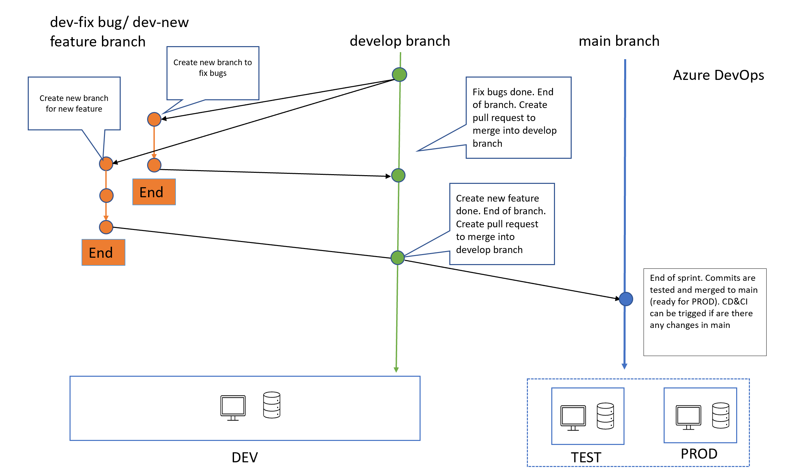

# Branching Strategy

This document explains how to handle setup your code repository to create your CI/CD pipeline. In this document, we use uppercase DEV, TEST, PROD to refer to environments and lowercase when talking about branches (dev, main)

## Design

The following diagram summarizes the recommended strategy and how it relates to the Azure resources.

## Architecture Recap

We provide the recommended general guidelines:

1. Each DS project should have at least two resource groups with with one AML instance in each: DEV-RG and PROD-RG. We recommend however to also setup a TEST-RG.

2. The code in DEV must be able to be run in TEST/PROD without applying any change to it

3. Data scientists (Dev team) have no right to modify code in TEST/PROD. They should have only view access rights.

## Branching

1. Create a dev branch from main from which one can create sub branches (feature engineering, hot fixes, etc).

2. Continuous Integration consists in running: linting, unit tests, data checks,..., and finally publishing an AML pipeline (either training or serving).

3. Any change applied to the main branch must be done through a Pull request. The approved PR may trigger a continuous integration process in TEST/PROD.