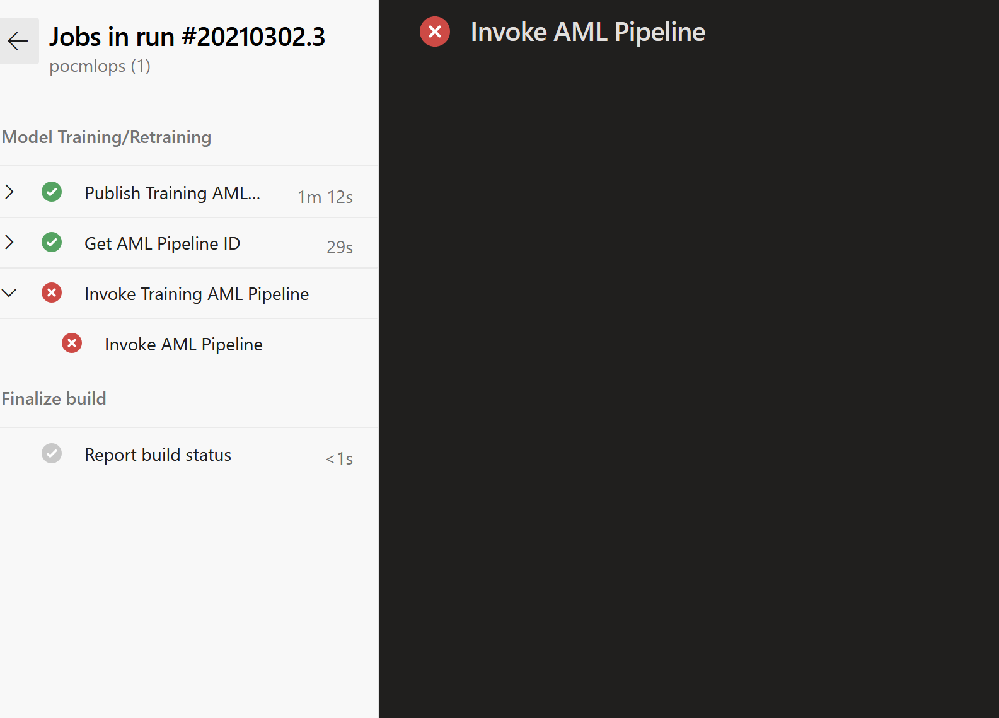

# Frequently Asked Question

## When running the ADO training pipeline, the pipeline fails at the _invoke_ step. What's the error ?

If you see the error below. You have to ensure that the service connection is created at the Azure Machine Learning Workspace level and not Subscription level

## I would like to adjust the Docker Image. How can I change the Dockerfile?

Documentation can be found here: 
**[Custom Dockerfile](AdjustingDockerfile.md)**
