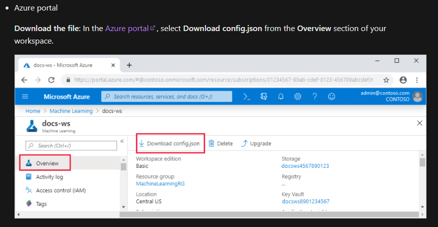

# Getting Started

## Clone it & Create Connection to AML

1. Clone the repo on your local machine

2. To be able to use the scripts on your local machine, add the azure ml workspace credentials in a **config.json** file in the root directory and, if it is not present already, **very important (!)** add it to the gitignore file.\
   

## Setup The Infrastructure

1. Navigate to [Azure DevOps](http://dev.azure.com/) and create a new organization and project. You can also re-use an existing organization and/or project.

2. Create a new [service connection](https://docs.microsoft.com/en-us/azure/devops/pipelines/library/service-endpoints?view=azure-devops&tabs=yaml) in Azure DevOps using **Azure Resource Manager**. To avoid errors due to different namings, we recommend you to have a look at the variable *SERVICECONNECTION_RG* the [configuration file](../../configuration/configuration-infra-DEV.variables.yml). Use this variable for the "Service connection" name. For the "Subscription", select the one where you want to deploy your infrastructure, and **leave empty** "Resource Group". . Azure DevOps will authenticate using this connection to make deployments to your Azure Subscription. For more information about security and parameters, click on the prior link.

## Run the pipeline

If you want to run the pipeline from your ADO repository, follow the steps bellow. If you want to run them from the github repo, have a look at the [contribution guide](../../CONTRIBUTING.md)

1. Add the pipeline in ADO and run it. For that go to _pipelines_ and click on _new pipeline_ at the top right. You should see the following screen 

Select: **Azure Repos Git**, the name repo where you clone this repo, **Existing Azure Pipelines YAML file** option and set the path to _/infrastructure/deploy-environment.template.yml_ and click on _continue_  In the _review_ section, click on _run_.

2. If everything has worked well, you should see your new resource groups in the Azure portal.

## Set Service Connection for Azure ML Workspace


## (Optional) Set your own variable names

3. Provide the following Environment variables in ADO:

- **[AML-related variables](../../configuration/configuration-aml.variables.yml)**: contains the definition of AML-related environment variables

```
PYTHON_VERSION: the version of python. Default value is 3.8
SDK_VERSION: the version of Azure ML SDK. Default value is 1.35
AML_DATASET: training dataset name.
AML_MODEL_NAME: model name (use in model register)

# Training
TRAINING_EXPERIMENT: training experiment name
TRAINING_PIPELINE: training pipeline name
TRAINING_COMPUTE: training computes name

# Batch inference
BATCHINFERENCE_EXPERIMENT: batch inference experiment name
BATCHINFERENCE_PIPELINE: batch inference pipeline name
BATCHINFERENCE_COMPUTE: batch inference compute name. Default name is $(TRAINING_COMPUTE)

# Real-time inference
AKS_COMPUTE: inference target name
AML_WEBSERVICE: webservice name
```

- **infra-related variables**: contains the definition of infra-related variables in DEV. By default, the template provides 2 environments: **[DEV](../../configuration/configuration-infra-DEV.variables.yml)** and **[PRD](../../configuration/configuration-infra-PRD.variables.yml)**

```
ENVIRONMENT: Name of environment. We use uppercase DEV, TEST, PRD to refer to environments
RESOURCE_GROUP: Name of the resourceGroup to create in this environment
LOCATION: Location for the resourceGroup in this environment
NAMESPACE: Namespace in this environment (use to identify and refer to the name of resources used in this environment).
SERVICECONNECTION_RG: Name of the Service Connection in Azure DevOps in subscription scope level
SERVICECONNECTION_WS: Name of the Service Connection in Azure DevOps in machine learning workspace scope level for this environment
AMLWORKSPACE: Name of the azure machine learning workspace in this environment. Default name is aml$(NAMESPACE)
STORAGEACCOUNT: Name of the storage account. Default name is sa$(NAMESPACE)
KEYVAULT: Name of the key vault. Default name is kv$(NAMESPACE)
APPINSIGHTS: Name of the app insight. Default name is ai$(NAMESPACE)
CONTAINERREGISTRY: Name of the container registry. Default name is cr$(NAMESPACE)
```

Once you have setup your variable, follow the instructions to [setup the infrastructure](./SetupInfrastructure.md).
