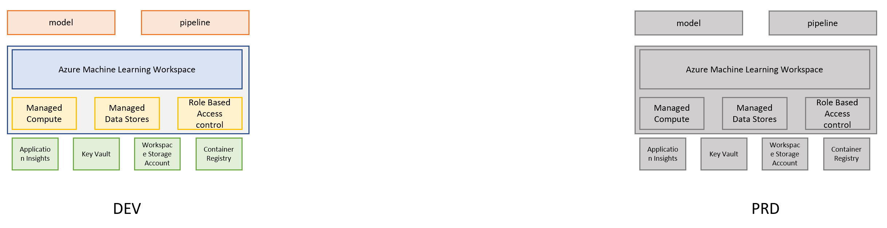
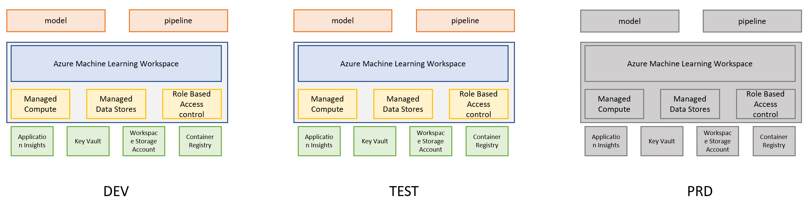

# Recommended Architecture

For teams who are starting with MLOps, we suggest to have at least two Azure Machine Learning instances. 
For teams with more familiarity with MLOps and Azure, we recommend to have three environments. 

If you want to learn more about best practices, you can visit [Azure CloudFramework BestPractices](https://docs.microsoft.com/en-us/azure/cloud-adoption-framework/ready/azure-best-practices/ai-machine-learning-resource-organization)

## Infrastructure Recap

This page explains how to setup an Azure architecture for your machine learning projects. The __templates__ folder contains Azure Resource Manager (ARM) templates to deploy your architecture in Azure Devops (ADO) and fine-tuned it to your team's requirement.

**[ARM-Templates](../../infra/arm-templates/)** contains json files to deploy specific Azure resources (Azure ML, App Insights, etc)

**[Pipeline full infrastructure](/../../infra/PIPELINE-0-setup.yml)**: deploys the entire infrastructure. Here, you can decide how many environments (DEV, TEST, QAT, PRD) you want to have. By default, the files provide DEV and PRD.

  
**Infra Variables configuration**:

- **[DEV instrastructure](../../configuration/configuration-infra-DEV.variables.yml)**: this file contains all the names you want to assign to your azure resources and location in DEV.
- **[PRD instrastructure](../../configuration/configuration-infra-PROD.variables.yml)**: this file contains all the names you want to assign to your azure resources and location in PRD.

For more detail, please refer to *[GettingStarted](GettingStarted.md)*
